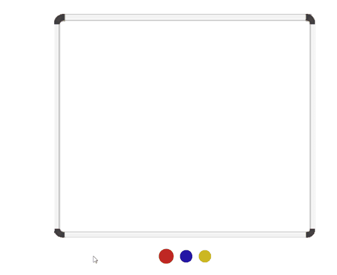

# React Magnetic Board

[![npm version][npm-badge]][npm-url]
[![npm bundle size][size-badge]][npm-url]
[![Build Status][build-badge]][build-url]

_Light, zero dependencies magnetic board component using HTML5 canvas 🧲_



## Demo

**[Live demo & Code examples](https://mkosir.github.io/react-magnetic-board)** created with [StoryTab 📑](https://github.com/mkosir/story-tab)

## Install

- npm `npm install react-magnetic-board`
- yarn `yarn add react-magnetic-board`

## Example

```jsx
import React from 'react';
import ReactDOM from 'react-dom';
import MagneticBoard from 'react-magnetic-board';

const circleSVG = 'M 100, 100  m -75, 0  a 75,75 0 1,0 150,0  a 75,75 0 1,0 -150,0';

const App = () => {
  return (
    <MagneticBoard
      magnet={{
        path: circleSVG,
        scale: 0.25,
        offsetX: 100,
        offsetY: 90,
        fillStyle: '#d93030',
        shadowColor: '#bf2626',
        shadowBlur: 5,
      }}
      width={600}
      height={500}
    />
  );
};

ReactDOM.render(<App />, document.getElementById('root'));
```

## Props

All of the props are optional.  
Below is the complete list of possible props and their options:

> ▶︎ indicates the default value if there's one

**magnet**: _Magnet_ ▶︎ `undefined`  
_Magnet = {
**path**: string;
**scale?**: number;
**offsetX?**: number;
**offsetY?**: number;
**fillStyle?**: string;
**shadowColor?**: string;
**shadowBlur?**: number;
**x?**: number;
**y?**: number;
}_  
Magnet resource.

**width**: _number_ ▶︎ `500`  
Magnetic Board width.

**height**: _number_ ▶︎ `400`  
Magnetic Board height.

**className**: _string_ ▶︎ `undefined`  
Class name.

**initMagnets**: _Magnet[]_ ▶︎ `[]`  
Initialize magnets.

**onUndo**: _boolean_ ▶︎ `undefined`  
Inverting 'onUndo' prop value triggers undo command.

**onClear**: _boolean_ ▶︎ `undefined`  
Inverting 'onClear' prop value clears the board.

**onMagnetChange**: _Function_ => (**magnets**: _Magnet[]_)  
Gets triggered when user changes magnet(s) on the component.

## Development

_Easily set up a local development environment!_

Build all the examples and starts storybook server on [localhost:9009](http://localhost:9009):

- clone
- `npm install`
- `npm start`

OR

Clone this repo on your machine, navigate to its location in the terminal and run:

```bash
npm install
npm link # link your local repo to your global packages
npm run build:watch # build the files and watch for changes
```

Clone project repo that you wish to test with react-magnetic-board library and run:

```bash
npm install
npm link react-magnetic-board # link your local copy into this project's node_modules
npm start
```

**Start coding!** 🎉

## Roadmap

- Move magnet(s)
- Add marker pens and eraser
- Tests

[npm-url]: https://www.npmjs.com/package/react-magnetic-board
[npm-badge]: https://img.shields.io/npm/v/react-magnetic-board.svg
[size-badge]: https://img.shields.io/bundlephobia/minzip/react-magnetic-board.svg
[build-badge]: https://travis-ci.com/mkosir/react-magnetic-board.svg
[build-url]: https://travis-ci.com/mkosir/react-magnetic-board
